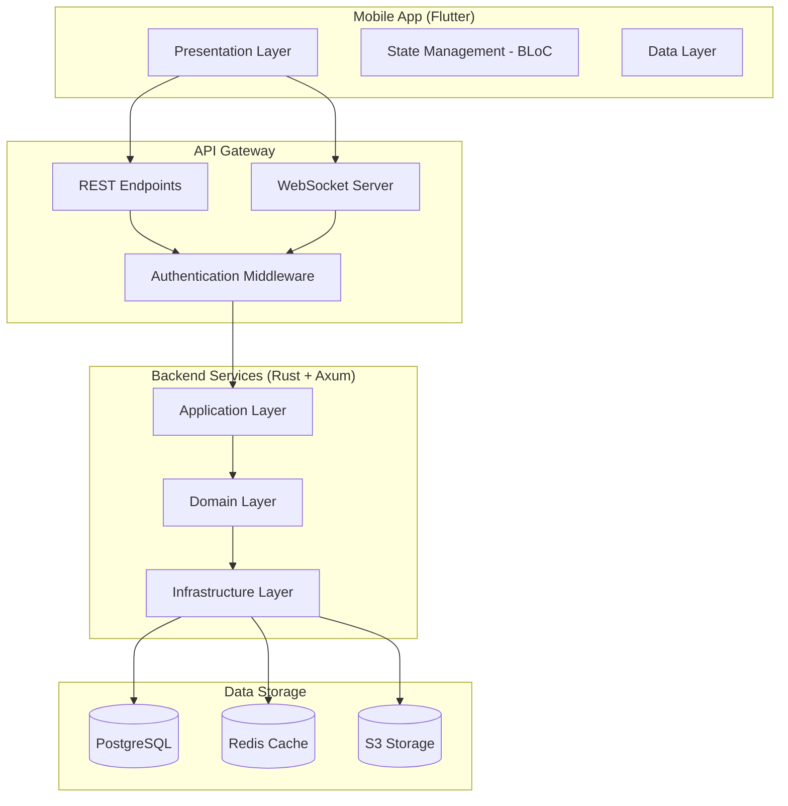

# VIEW Social MVP Design Document

## Overview

VIEW Social MVP is a comprehensive social media platform built using Clean Architecture principles with Rust/Axum backend and Flutter frontend. The system integrates three core domains: Social (Twitter-inspired), Messaging (iMessage-inspired), and Payments (WeChat-inspired) into a unified mobile experience.

The architecture emphasizes scalability, security, and performance with real-time capabilities through WebSocket connections, robust payment processing, and optimized database queries to prevent N+1 problems.

## Architecture

### System Architecture Diagram



### Clean Architecture Layers

1. **Presentation Layer (Flutter)**
   - UI screens and widgets
   - BLoC state management
   - Theme and styling

2. **API Layer (Axum)**
   - REST endpoints
   - WebSocket handlers
   - Middleware (auth, CORS, rate limiting)

3. **Application Layer**
   - Use cases and commands
   - Service orchestration
   - Event handling

4. **Domain Layer**
   - Business entities and aggregates
   - Domain services
   - Repository interfaces

5. **Infrastructure Layer**
   - Database implementations
   - External service integrations
   - Caching and storage

## Components and Interfaces

### Domain Bounded Contexts

#### Social Context
- **User Aggregate**: Profile, followers, following, creator stats
- **Post Aggregate**: Content, media attachments, engagement metrics
- **Comment Entity**: Nested comments with like counts
- **Engagement Services**: Like, comment, reshare operations

#### Messaging Context
- **Conversation Aggregate**: Participants, metadata, group settings
- **Message Entity**: Content, media, payment data, read receipts
- **Contact Entity**: VIEW users and phone contacts
- **Presence Service**: Online status and typing indicators

#### Payment Context
- **Wallet Aggregate**: Balance, currency, security settings
- **Transaction Aggregate**: Sender, receiver, amount, status
- **Payment Processor Service**: Transfer validation and execution
- **Command Parser**: "/viewpay [amount]" parsing logic

### Key Interfaces

```rust
// Repository Traits
#[async_trait]
pub trait PostRepository: Send + Sync {
    async fn create(&self, post: &Post) -> Result<Post>;
    async fn find_feed(&self, user_id: Uuid, limit: i64, offset: i64) -> Result<Vec<Post>>;
    async fn increment_engagement(&self, post_id: Uuid, engagement_type: EngagementType) -> Result<()>;
}

#[async_trait]
pub trait MessageRepository: Send + Sync {
    async fn create(&self, message: &Message) -> Result<Message>;
    async fn find_by_conversation(&self, conversation_id: Uuid, limit: i64, before_id: Option<Uuid>) -> Result<Vec<Message>>;
    async fn mark_as_read(&self, message_id: Uuid, user_id: Uuid) -> Result<()>;
}

#[async_trait]
pub trait WalletRepository: Send + Sync {
    async fn find_by_user_id(&self, user_id: Uuid) -> Result<Option<Wallet>>;
    async fn update_balance(&self, wallet_id: Uuid, amount: Decimal) -> Result<()>;
    async fn create_transaction(&self, transaction: &Transaction) -> Result<Transaction>;
}
```

### WebSocket Event System

```rust
#[derive(Debug, Clone, Serialize, Deserialize)]
#[serde(tag = "type", rename_all = "snake_case")]
pub enum WebSocketEvent {
    MessageSent { conversation_id: Uuid, message: MessageDTO },
    MessageRead { message_id: Uuid, user_id: Uuid },
    TypingStarted { conversation_id: Uuid, user_id: Uuid },
    PaymentReceived { transaction_id: Uuid, amount: String, sender: UserDTO },
    PostLiked { post_id: Uuid, user_id: Uuid },
    UserOnline { user_id: Uuid },
    Error { message: String },
}
```

## Data Models

### Core Entities

#### User Entity
```rust
pub struct User {
    pub id: Uuid,
    pub username: String,
    pub email: String,
    pub phone_number: Option<String>,
    pub display_name: Option<String>,
    pub bio: Option<String>,
    pub avatar_url: Option<String>,
    pub is_verified: bool,
    pub follower_count: i32,
    pub following_count: i32,
    pub created_at: DateTime<Utc>,
}
```

#### Post Entity
```rust
pub struct Post {
    pub id: Uuid,
    pub user_id: Uuid,
    pub content_type: PostContentType,
    pub text_content: Option<String>,
    pub media_urls: Vec<MediaAttachment>,
    pub is_reel: bool,
    pub visibility: PostVisibility,
    pub like_count: i32,
    pub comment_count: i32,
    pub reshare_count: i32,
    pub created_at: DateTime<Utc>,
}
```

#### Message Entity
```rust
pub struct Message {
    pub id: Uuid,
    pub conversation_id: Uuid,
    pub sender_id: Option<Uuid>,
    pub message_type: MessageType,
    pub content: Option<String>,
    pub media_url: Option<String>,
    pub payment_data: Option<PaymentData>,
    pub reply_to_id: Option<Uuid>,
    pub created_at: DateTime<Utc>,
}
```

#### Wallet Entity
```rust
pub struct Wallet {
    pub id: Uuid,
    pub user_id: Uuid,
    pub balance: Decimal,
    pub currency: String,
    pub status: WalletStatus,
    pub pin_hash: Option<String>,
    pub created_at: DateTime<Utc>,
}
```

### Database Schema

The system uses PostgreSQL with the following key tables:
- `users` - User accounts and profiles
- `posts` - Social media content
- `comments` - Post comments with threading
- `conversations` - Message threads
- `messages` - Individual messages
- `wallets` - Payment accounts
- `transactions` - Money transfers
- `follows` - User relationships
- `post_likes` - Engagement tracking

Performance optimizations include:
- Materialized view `user_feed_cache` for efficient feed generation
- Database triggers for counter updates
- Proper indexing on frequently queried columns

## Correctness Properties

*A property is a characteristic or behavior that should hold true across all valid executions of a system-essentially, a formal statement about what the system should do. Properties serve as the bridge between human-readable specifications and machine-verifiable correctness guarantees.*

Property 1: User registration uniqueness
*For any* valid registration data, creating a user account should enforce unique username and email constraints
**Validates: Requirements 1.1**

Property 2: Profile data persistence
*For any* user profile update, all provided profile fields should be stored and retrievable
**Validates: Requirements 1.2**

Property 3: Wallet creation consistency
*For any* newly created user, exactly one wallet should be automatically created and associated
**Validates: Requirements 1.3**

Property 4: Authentication token generation
*For any* valid login credentials, the system should generate and return valid JWT tokens
**Validates: Requirements 1.4**

Property 5: Post creation validation
*For any* text post creation, content should be validated and published to the user's feed
**Validates: Requirements 2.1**

Property 6: Media association consistency
*For any* post with media content, all uploaded media should be properly associated with the post
**Validates: Requirements 2.2**

Property 7: Reel duration validation
*For any* reel creation, video content under 60 seconds should be accepted and marked as reel content
**Validates: Requirements 2.3**

Property 8: Feed content filtering
*For any* user's feed request, only posts from followed users should be included in the response
**Validates: Requirements 3.1**

Property 9: Engagement tracking consistency
*For any* post like action, the like count should increment and engagement should be recorded
**Validates: Requirements 3.2**

Property 10: Typing indicator propagation
*For any* typing event in a conversation, typing indicators should be sent to all other participants
**Validates: Requirements 4.2**

Property 11: Message read status tracking
*For any* message read action, the message should be marked as read and read receipts updated
**Validates: Requirements 4.3**

Property 12: Payment processing consistency
*For any* valid money transfer, sender balance should decrease and receiver balance should increase by the same amount
**Validates: Requirements 5.1**

Property 13: Payment message creation
*For any* in-chat payment, a special payment message should be created and linked to the transaction
**Validates: Requirements 5.2**

Property 14: Payment command parsing
*For any* message containing "/viewpay [amount]", the system should correctly parse the amount and trigger payment flow
**Validates: Requirements 5.3**

Property 15: Wallet balance accuracy
*For any* wallet query, the returned balance should reflect all completed transactions
**Validates: Requirements 6.1**

Property 16: Insufficient funds validation
*For any* payment attempt with insufficient balance, the transaction should be rejected and no balance changes should occur
**Validates: Requirements 6.4**

Property 17: JWT token security
*For any* authentication request, JWT tokens should be generated with proper expiration and refresh mechanisms
**Validates: Requirements 9.1**

Property 18: Password hashing security
*For any* password storage, bcrypt hashing with cost factor 12 should be used
**Validates: Requirements 9.2**

## Error Handling

### Error Types
```rust
#[derive(Debug, thiserror::Error)]
pub enum AppError {
    #[error("Database error: {0}")]
    DatabaseError(String),
    
    #[error("Authentication failed: {0}")]
    AuthenticationError(String),
    
    #[error("Validation error: {0}")]
    ValidationError(String),
    
    #[error("Payment error: {0}")]
    PaymentError(String),
    
    #[error("Not found: {0}")]
    NotFound(String),
    
    #[error("Insufficient funds")]
    InsufficientFunds,
    
    #[error("Rate limit exceeded")]
    RateLimitExceeded,
}
```

### Error Response Strategy
- **Client Errors (4xx)**: Return detailed error messages for validation failures
- **Server Errors (5xx)**: Log full error details, return generic messages to clients
- **Payment Errors**: Special handling with transaction rollback and audit logging
- **Rate Limiting**: Implement exponential backoff suggestions

## Testing Strategy

### Dual Testing Approach

The system will use both unit testing and property-based testing for comprehensive coverage:

**Unit Testing:**
- Test specific examples and edge cases
- Verify integration points between components
- Test error conditions and boundary values
- Framework: Built-in Rust testing with `tokio-test` for async code

**Property-Based Testing:**
- Verify universal properties across all inputs
- Test business logic invariants
- Validate data consistency rules
- Framework: `proptest` for Rust backend
- Configuration: Minimum 100 iterations per property test
- Each property test must reference the corresponding design document property using format: `**Feature: view-social-mvp, Property {number}: {property_text}**`

**Testing Requirements:**
- Each correctness property must be implemented by a single property-based test
- Property tests should run 100+ iterations to ensure statistical confidence
- Unit tests complement property tests by covering specific scenarios
- All tests must be tagged with requirement references for traceability

### Backend Testing Stack
- **Unit Tests**: `#[tokio::test]` with mock repositories
- **Property Tests**: `proptest` with custom generators
- **Integration Tests**: Real database with test containers
- **Performance Tests**: `criterion` for benchmarking critical paths

### Frontend Testing Stack
- **Unit Tests**: Flutter test framework
- **Widget Tests**: Test UI components in isolation
- **Integration Tests**: `flutter_driver` for end-to-end flows
- **Golden Tests**: Screenshot comparison for UI consistency